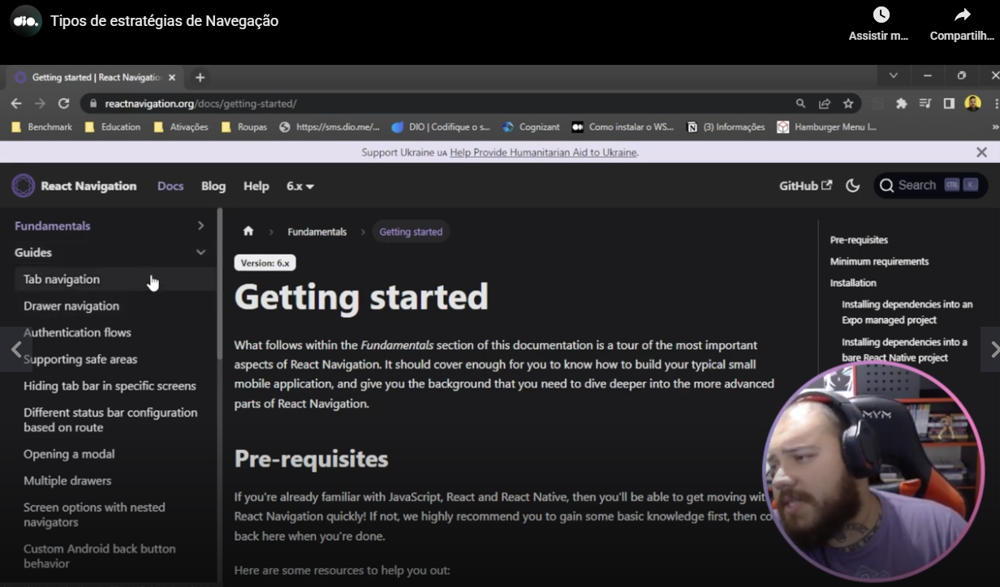
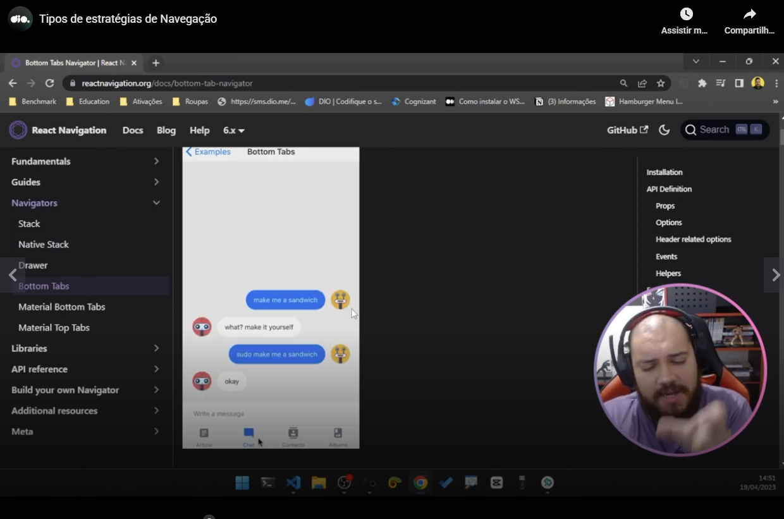

# Acessing documentation

Teacher accessed in the home page of [reactnavigation.org](http://reactnavigation.org) the button "Read docs". There he could saw this menu related to types of navigations when clicked in **"Guides"**:

# Different types of navigations

See in the next image te example of "**Bottom Tabs**" navigation and his butons in the lower part of the app:

