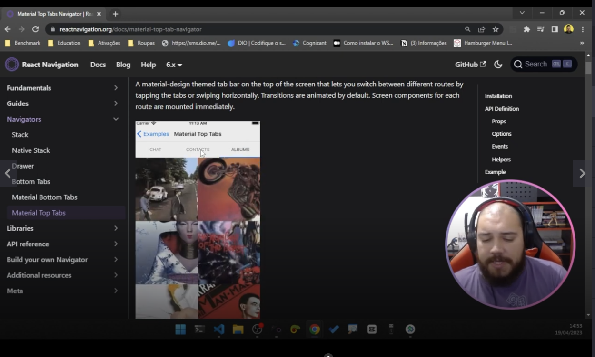
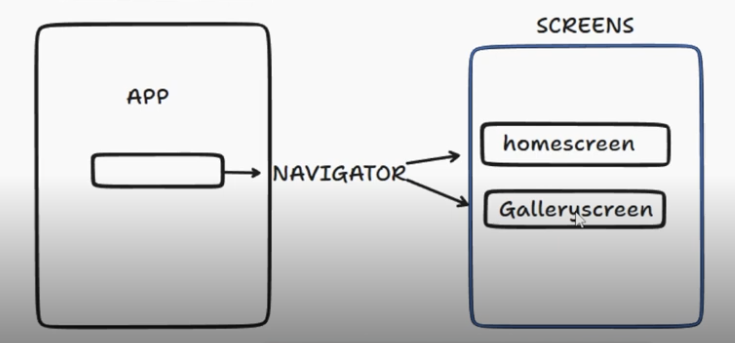
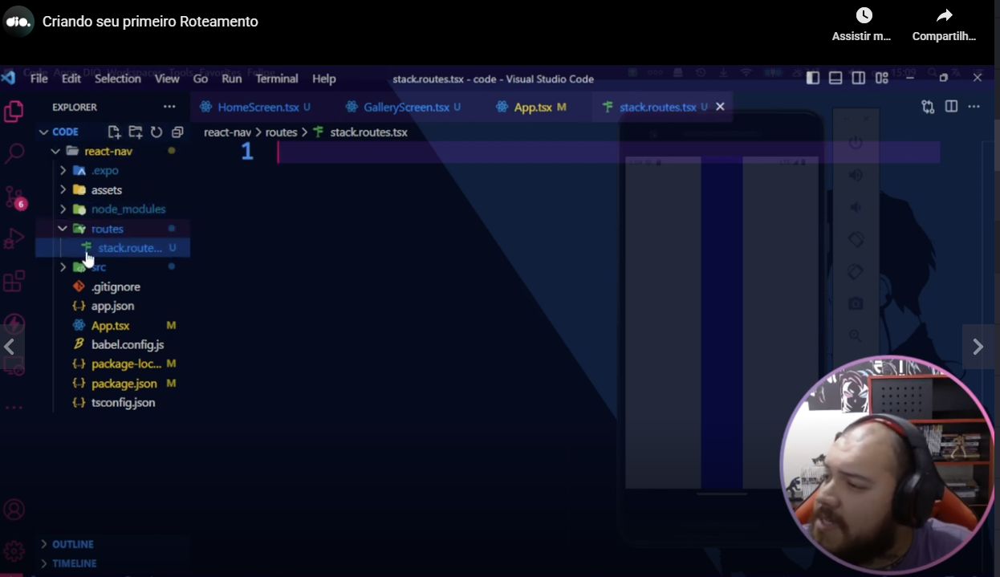
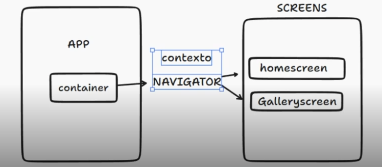

# Acessing documentation

Teacher accessed in the home page of [reactnavigation.org](http://reactnavigation.org) the button "Read docs". There he could saw this menu related to types of navigations when clicked in **"Guides"**:


# Different types of navigations

See in the next image te example of "**Bottom Tabs**" navigation and his butons in the lower part of the app:


Teacher also talked that a very common navigation is "**Stack navigation**". In this navigations the pagas acts as elements of a stack of pages.

Teacher explained that is common a mobile app being more simple than a web app and to have mave less functionalities to be simpler.

See in the next image an example of material top navigation:



**Drawer navigation**: teacher said that is an example of navigation that you can pull a menu from the side of the app.


Teacher instructed us to not mix several types of navigations in an app to the app not to be confuse for the user.


# What is a navigator

Teacher explained that a navigator is who select between screens using routes (arrows between navigator and the screens in the following image):




# Creating your first routing

Teacher instructed us to create a file to each navigation strategy:



In the previous image pay attention to the file **routes/stack.routes.tsx**.

Teacher said that the icons showed in the previous image in VSCode are provided by the extension material icons.


# Installing the library to use stack navigation

As you can see in [this repository](https://github.com/andreterceiro/dio-mobile-meu-tudo--navigation-on-react-native), teacher  said that we already installed some dependencies. The React Navigator do not install all things in one way, you have to install an additional part.

The command to install stack navigation is (as you can see [in the documentation](http://reactnavigation.org)):

```
npm install @react-navigation/stack
```

I created a test project in tests\01 with the command:

```
expo init react-nav --npm
```

After, I installed the stack navigation (`npm install @react-navigation/stack`)

Please see the test project. There I inserted the code of routes/stack.routes.tsx and also I copied the files HomeScren.tsx and GalleryScreen.tsx from [this repository](https://github.com/andreterceiro/dio-mobile-meu-tudo--navigation-on-react-native/).

Here I will put the code of **routes/stack.routes.tsx** from the test project, but please see the entire code of the test project in tests/01 directory:

```typescript
import {createStackNavigator} from  '@react-navigation/stack'

const { Screen, Navigator } = createStackNavigator()

import HomeScreen from '../src/screens/HomeScreen'
import GalleryScreen from '../src/screens/GalleryScreen'

export function StackRoutes() {
    return (
        <Navigator>
            <Screen name='home' component={HomeScreen} />
            <Screen name='gallery' component={GalleryScreen} />            
        </Navigator>
    )    
}
```


# Context

Teacher complemented his explanation with this image:



What is the container in the image? Teacher explained that we can think that the container is like a box with all the possible navigators. Because the app can have all the possible navigation contexts. As example 1 context for a logged user, 1 context for a non logged user. 1 navigator for each context.


# Random comment

Ia a class teacher instructed us to move the routes file to the src directory.


# Context again

Teacher said that now we will do the little box that will expose all of our routes contexts to our application, a configuration file.

Teacher resumed route context as a type of navigation and routes a user profile can access (using other words).

Now we developed the file **routes/index.tsx**. The first line of this file is:

```typescript
import { NavigationContainer } from '@react-navigation/native'
```

NavigationContainer in this line will create a container of navigators.